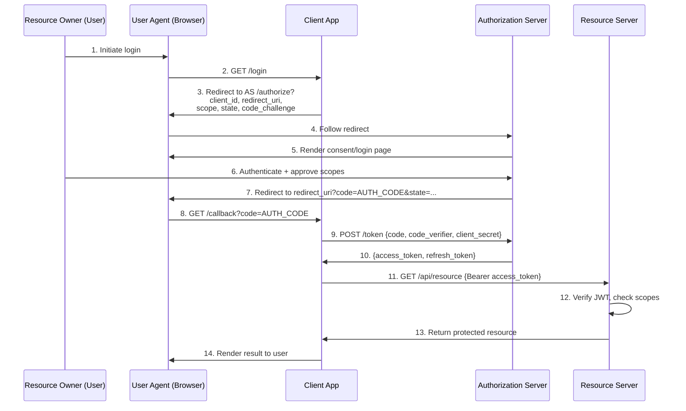

# OAuth 2.0 Architecture Deep Dive

## The Authorization Code Flow

OAuth 2.0's Authorization Code Flow is the gold standard for web applications. Understanding each step is essential for identifying where attacks occur.



## Key Protocol Components

### Authorization Request Parameters

| Parameter | Required | Purpose | Security Role |
|-----------|----------|---------|---------------|
| `response_type=code` | Yes | Request an authorization code | — |
| `client_id` | Yes | Identifies the client | Must be registered |
| `redirect_uri` | Yes | Where to send the code | Must exactly match registration |
| `scope` | Recommended | Requested permissions | Enforced at token issuance |
| `state` | Recommended | Random nonce | CSRF prevention |
| `code_challenge` | PKCE | SHA256(code_verifier) | Prevents code interception |
| `code_challenge_method` | PKCE | S256 or plain | S256 required in production |

### JWT Access Token Structure

```json
// Header
{
  "alg": "HS256",
  "typ": "JWT"
}

// Payload
{
  "jti": "unique-token-id",        // For revocation
  "sub": "user-id",                // Subject (user)
  "username": "alice",
  "client_id": "legitimate-client",
  "scope": "read profile",         // Granted scopes
  "roles": ["user"],
  "iss": "http://localhost:3001",  // Issuer
  "aud": "http://localhost:3003",  // Intended audience
  "exp": 1234567890,               // Expiry (Unix timestamp)
  "iat": 1234564290                // Issued at
}

// Signature
HMACSHA256(base64url(header) + "." + base64url(payload), secret)
```

## Attacker Interception Points

```
User ──────────────────────────────────────────────────────────────► Auth Server
   │                                    ▲           │
   │                                    │           │ Authorization Code
   │                                    │           ▼
   │   Redirect URI         ┌───────────────────────────┐
   │   Manipulation ───────►│  ⚠️ Interception Point 1  │
   │   (Attack 1)           │  Code captured if bad     │
   │                        │  redirect_uri validation  │
   │                        └───────────────────────────┘
   │
   ▼
Client App ──────────────────────────────────────────────────────►  Token Endpoint
   │           ▲                                    │
   │           │ Code Interception                  │ Code Exchange
   │           │ (Attack 2 — no PKCE)               │
   │           │                                    ▼
   │   ┌───────────────────────────┐      Access Token + Refresh Token
   │   │  ⚠️ Interception Point 2  │              │
   │   │  Attacker intercepts code │              │
   │   │  in transit / referrer    │              │
   │   └───────────────────────────┘              │
   │                                              ▼
   │                                    ┌──────────────────────┐
   │                                    │  Token Storage       │
   │   XSS Attack ───────────────────►  │  ⚠️ Attack Point 3  │
   │   (Attack 3)                       │  localStorage = bad  │
   │                                    │  HttpOnly cookie = ✅│
   │                                    └──────────────────────┘
   │
   ▼
Resource Server ── JWT Verification ── ⚠️ Attack Point 7: alg=none bypass
```

## PKCE Flow Detail

PKCE (Proof Key for Code Exchange) binds the authorization request to the token exchange:

```
Client generates:
  code_verifier = random 32-byte string (base64url encoded)
  code_challenge = BASE64URL(SHA256(ASCII(code_verifier)))

Authorization Request:
  GET /authorize?...&code_challenge=CHALLENGE&code_challenge_method=S256

  → Auth server stores: {code: "xyz", challenge: CHALLENGE}

Token Exchange:
  POST /token {code: "xyz", code_verifier: VERIFIER}

  → Server computes: SHA256(VERIFIER) and compares to stored CHALLENGE
  → If match: issue tokens ✅
  → If no match: reject ❌
  → If code was stolen: attacker has no VERIFIER → cannot exchange ✅
```

## Refresh Token Rotation

```
Initial login:
  access_token_1 + refresh_token_1

First refresh:
  Client sends: refresh_token_1
  Server:       revoke(refresh_token_1) → issue refresh_token_2
  Client gets:  access_token_2 + refresh_token_2

If attacker steals refresh_token_1 and uses it AFTER legitimate client:
  refresh_token_1 already revoked → attacker gets 400 invalid_grant
  
If attacker steals and uses BEFORE legitimate client:
  attacker gets tokens, legitimate client's next refresh fails
  → Server detects reuse → can revoke entire token family
```
